# [Franco](https://github.com/altsplicer) / [***Maser***](https://altsplicer.github.io/DEseq2_Script/DESEQ2_met.html)
[](#nolink)

Script [LINK](https://github.com/Altsplicer/MaserVP_script/blob/main/r/MaserVP.R)

## Overview

This a walk-through of the Maser script used for Met Cancer project in the Hertel and Kaiser lab. MASER is a R package from Bioconductor used in the task of analyzing and visualization of alternative splicing events generated by rMATS. See the following link for a [maser](https://www.bioconductor.org/packages/devel/bioc/vignettes/maser/inst/doc/Introduction.html) tutorial from the creator Diogo Veiga. This walk-through is adapted from that tutorial. You can also see this walk-through via this [link](https://altsplicer.github.io/Methionine-AltSplicing/DESEQ2_RMD.html).

## Installation and Load into R studio

```{r}
# if (!require("BiocManager", quietly = TRUE))
#   install.packages("BiocManager")
# BiocManager::install("maser")

library(maser)

```

## Location of rmats results

Computer path to your rmats result folder

```{r}
path <- "./468_0_v_468_12"
```

## Creating a maser object with the Rmats file.

```{r}
# maser(path, cond_labels, ftype = c("ReadsOnTargetAndJunctionCounts","JunctionCountOnly", "JCEC", "JC"))
# cond_labels) refers to the condition labels
# ftype refers to rMATS file type
# storing the maser object in Met
Met <- maser(path, c("MB468_0mins", "MB468_720mins"), ftype = "JCEC")
# You can call Met and get a description of the maser object
Met
```
[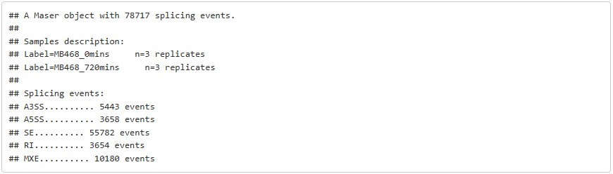](#nolink)

Head of summary of the rmats output based on the alternative splicing event.

```{r}
head(summary(Met, type = "SE")[, 1:8])
```
[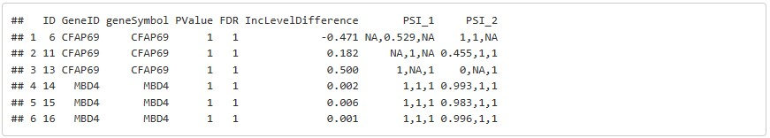](#nolink)

## Fitler significant events

filterByCoverage() allows us to remove low coverage events, this will most likely reduce the number of splicing events.

```{r}
# By using 5 for avg_read we are only keeping events who have 5 reads or more.
Met_filt <- filterByCoverage(Met, avg_reads = 5)
```
topEvents() allows to select statistically significant events given a FDR cutoff and minimum PSI change. Default values are fdr = 0.05 and deltaPSI = 0.1.

```{r}
# we can store this function in a vector we called Met_top
Met_top <- topEvents(Met_filt, fdr = 0.05, deltaPSI = 0.1)

# we can call it
Met_top

```
[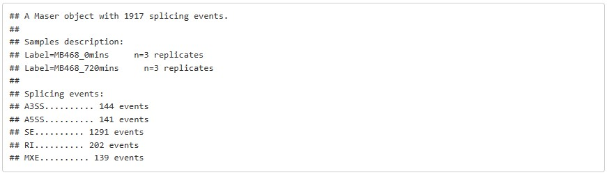](#nolink)

## Volcano Plots

An overview of significant events can be obtained using either the dotplot() function, to make a dot plot, or the volcano() function to make a volcano plot, specifying FDR levels, minimum change in PSI between conditions and splicing type. Significant events in each condition will be highlighted.

```{r}
# using the Met vector allows to view all splicing events captured with a highlighting of the significant events
# note that type refers to the splicing event type, SE is skipped exon events
volcano(Met, fdr = 0.05, deltaPSI = 0.1, type = "SE")
```
[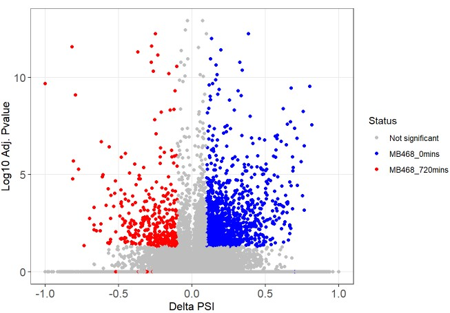](#nolink)

```{r}
# using the Met_top vector allows us to ignore any non significant splicing events
top_volcano_se <- volcano(Met_top, fdr = 0.05, deltaPSI = 0.1, type = "SE")
# calling the volcano plot
top_volcano_se
```
[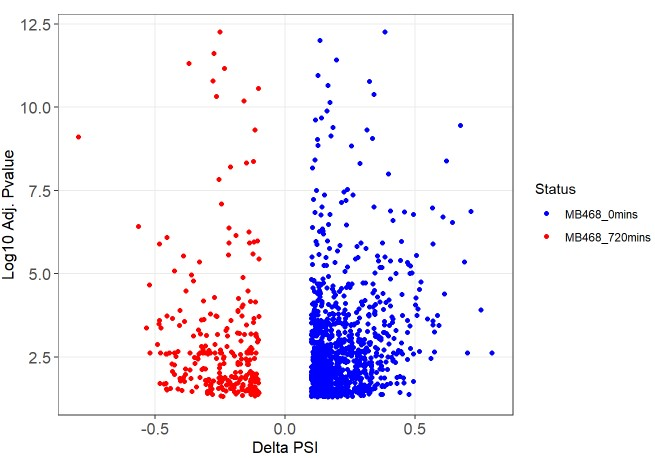](#nolink)

## Further customization with ggplot2

The reason we place our volcano plot in top_volcano_se is because it makes it easier to further customize the plot using ggplot2 commands. You can Google various ggplot2 customization options ggplot2 cheat sheet can be found at this link. <https://statsandr.com/blog/files/ggplot2-cheatsheet.pdf>

```{r}
# theme() allows you to change aspects of the volcano plot.
# the + denotes a new customization option on top_volcano_se.
top_volcano_se + theme(axis.title.x = element_text(size=18)) + theme(axis.title.y = element_text(size=18))+ theme(legend.key=element_rect(fill='bisque')) + guides(colour = guide_legend(override.aes = list(size=4))) + theme(legend.text=element_text(size=15)) + theme(axis.title = element_text(size = 18)) + 
theme(legend.title=element_blank()) + theme(axis.text.x  = element_text(size=16)) + ggtitle("MB468_0mins vs MB468_720mins (Skipped Exon)") + theme(plot.title = element_text(lineheight=.8, face="bold")) + theme(axis.text.y  = element_text(size=16)) + theme(plot.title = element_text(size=18)) +
xlim(-0.75, 0.75)
```
[](#nolink)
[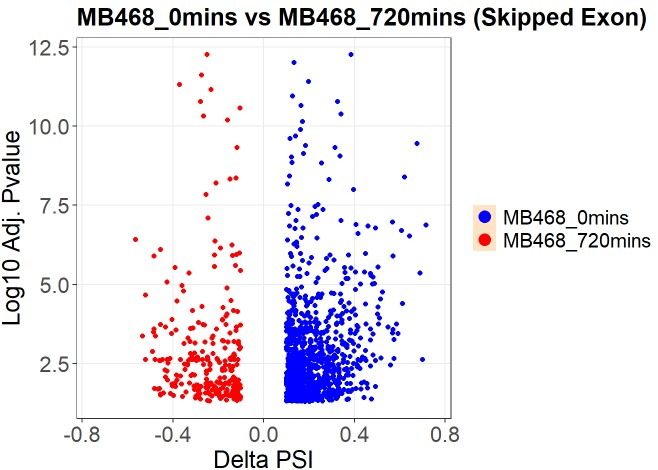](#nolink)

## Splicing events

This are examples of the other alternative splicing events that be visualized

```{r}
# Retained Intron
volcano(Met_filt, fdr = 0.05, deltaPSI = 0.1, type = "RI")
```
[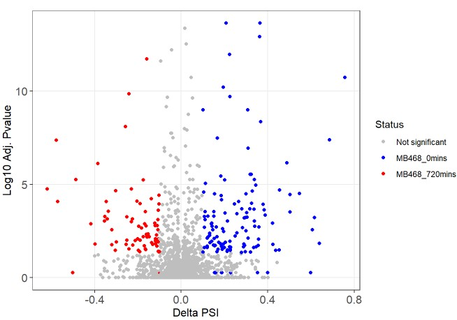](#nolink)

```{r}
# Mutually exclusive exons
volcano(Met_filt, fdr = 0.05, deltaPSI = 0.1, type = "MXE")
```
[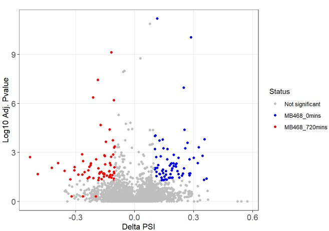](#nolink)

```{r}
# Alternative 5' splice sites
volcano(Met_filt, fdr = 0.05, deltaPSI = 0.1, type = "A5SS")
```
[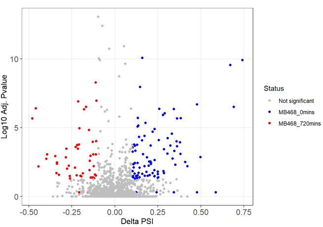](#nolink)

```{r}
# Alternative 3' splice sites
volcano(Met_filt, fdr = 0.05, deltaPSI = 0.1, type = "A3SS")
```
[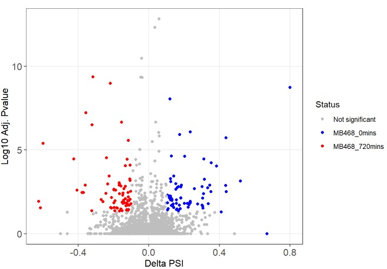](#nolink)

## Splicing distribution
Visualise splicing distribution The breakdown of splicing types can be plotted using splicingDistribution() and desired significance thresholds.

```{r}
splicingDistribution(Met_filt, fdr = 0.05, deltaPSI = 0.1)
```
[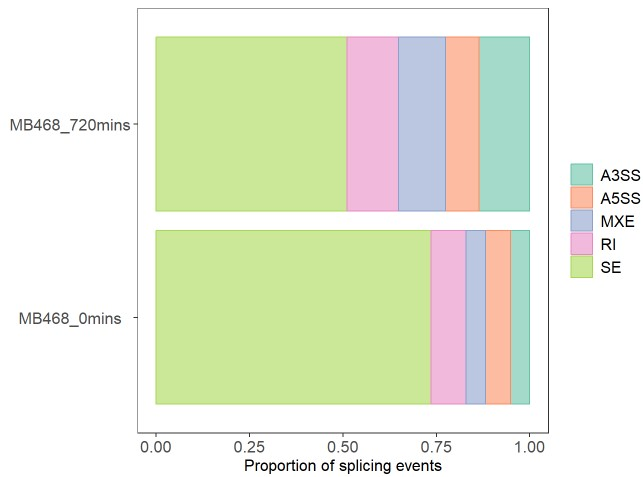](#nolink)

## Dotplot visualization 

```{r}
dotplot(Met_top, type = "SE")
```
[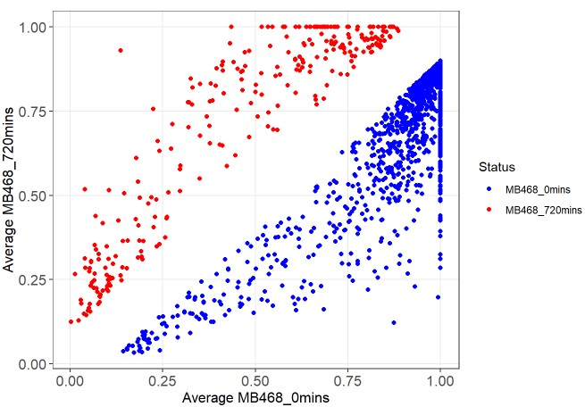](#nolink)
